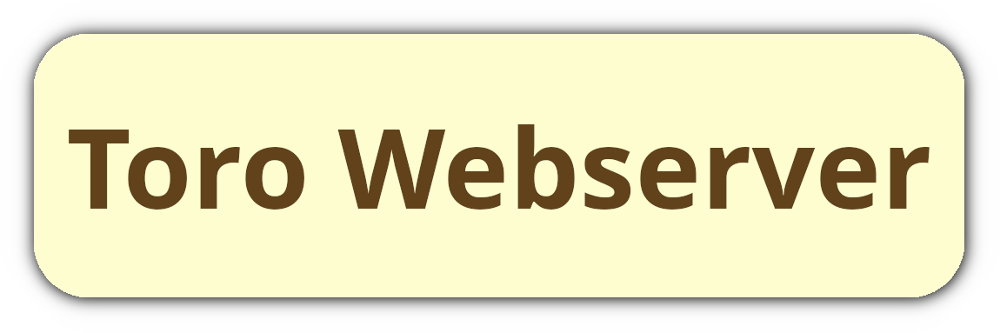

<h1 align="center">
  <a href="https://github.com/zUltimaPG3D/toro-webserver/"></a>
  <br>
  toro-webserver
  <br>
</h1>

<h4 align="center">A barebones NeptuneSDK, LineSDK and Toro Puzzle API server recreation for <a href="https://github.com/zUltimaPG3D/town-restoration/" target="_blank">town-restoration</a>.</h4>

<p align="center">
  <a href="#overview">Overview</a> •
  How To Use (<a href="#how-to-use-non-dockerized">non-dockerized</a> or <a href="#how-to-use-dockerized">dockerized</a>) •
  <a href="#credits">Credits</a> •
  <a href="#others-like-this">Others like this</a> •
  <a href="#license">License</a>
</p>

> ## WARNING!
> This project is still in development. A lot of game endpoints are still missing and still need to be implemented. A lot of things may also change in the future, like the save data handling and more.

## Overview

Toro and Friends: Onsen Town, a mobile Doko Demo Issyo game mostly based around connect-three puzzles, had two versions: the Japanese version and the Localized version.

The Localized version of the game died just like the Japanese version, but unlike the Japanese version, no patch was made for it to run independently of the servers.

This project is a recreation of most of the services the Localized version of the game uses, which makes the game finally work again, as long as certain modifications are made to the game itself (such as using [town-restoration](https://github.com/zUltimaPG3D/town-restoration/)).

> * **Note**:
> Due to it not being meant for public hosting, the server currently saves all the user data in multiple `.json` files in the `./player_data` directory, and doesn't separate every file if there are more than one player.

## How To Use (non-dockerized)

This program depends on [Deno](https://deno.com/) and [npm](https://www.npmjs.com/) to run. You'll need both `deno` and `npm` installed on your machine.

Assuming you already have both installed, you can set up the program like so:

```bash
# Clone the repository
$ git clone https://github.com/zUltimaPG3D/toro-webserver

# Go into the repository
$ cd toro-webserver

# Install dependencies
$ deno install

# If the user doesn't have write permissions
# $ sudo chown -R deno:deno ./player_data

# Run the program
$ deno task run
```

## How To Use (dockerized)

Alternatively, you can use [Docker](https://docker.com/) to run the program.

Currently, there is no prebuilt image, but you can build one yourself and run it like so:

```bash
# Clone the repository
$ git clone https://github.com/zUltimaPG3D/toro-webserver

# Go into the repository
$ cd toro-webserver

# Build the image
$ docker build . -t toro-webserver

# Run the image
$ docker run -p 15151:15151 toro-webserver
```

> * **Note**:
> It is recommended to use volumes to make the `./player_data` directory persistent, so that data is not lost with the container.

## Credits

- [puzzle](https://code.autism.net.ru/synzr-archive/puzzle) by synzr (Apache 2.0): Used as reference for early server development
- [Markdownify](https://github.com/amitmerchant1990/electron-markdownify) by Amit Merchant (MIT): Used the README as a base for this project's README
- [Deno](https://deno.com/) by the Deno team (MIT): Used as the runtime for this project

## Others like this

- [puzzle](https://code.autism.net.ru/synzr-archive/puzzle) by synzr (Apache 2.0): An (incomplete) server recreation for Onsen Town written in JavaScript (Node.js) 

## License

GPL v3

---

